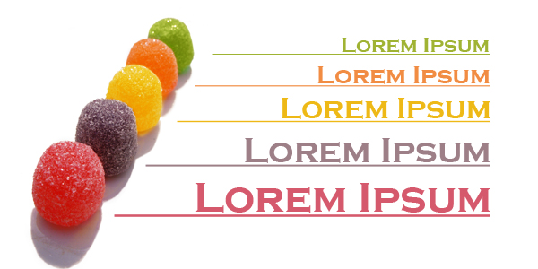

#Consectetuer

Lorem ipsum dolor sit amet, consectetuer adipiscing elit. Aenean commodo ligula eget dolor. Aenean massa. Cum sociis natoque penatibus et magnis dis parturient montes, nascetur ridiculus mus. 

- Donec quam felis, ultricies nec, pellentesque eu, pretium quis, sem. 

 

- Nulla consequat massa quis enim. Donec pede justo, fringilla vel, aliquet nec, vulputate eget, arcu. In enim justo, rhoncus ut, imperdiet a, venenatis vitae, justo.

- Nullam dictum felis eu pede mollis pretium.

~~~
package mypackage;

import de.svenjacobs.loremipsum.LoremIpsum;

public class MyClass 
{
  private LoremIpsum loremIpsum;
  
  public MyClass() 
  {
    this.loremIpsum = new LoremIpsum();
  }

  public MyData createDummyData() 
  {
    MyData data = new MyData();
    
    // returns 50 words of lorem ipsum text
    data.setText( loremIpsum.getWords( 50 ) );

    // returns 150 words of lorem ipsum text starting with
    // the third word (text will not begin with "Lorem ipsum")
    data.setAnotherText( loremIpsum.getWords( 150, 2 ) );
    
    // returns two paragraphs of lorem ipsum
    data.setYetAnotherText( loremIpsum.getParagraphs( 2 ) );
    
    return data;
  }
}
~~~

Lorem ipsum dolor sit amet, consectetuer adipiscing elit. Aenean commodo ligula eget dolor. Aenean massa. Cum sociis natoque penatibus et magnis dis parturient montes, nascetur ridiculus mus. 
